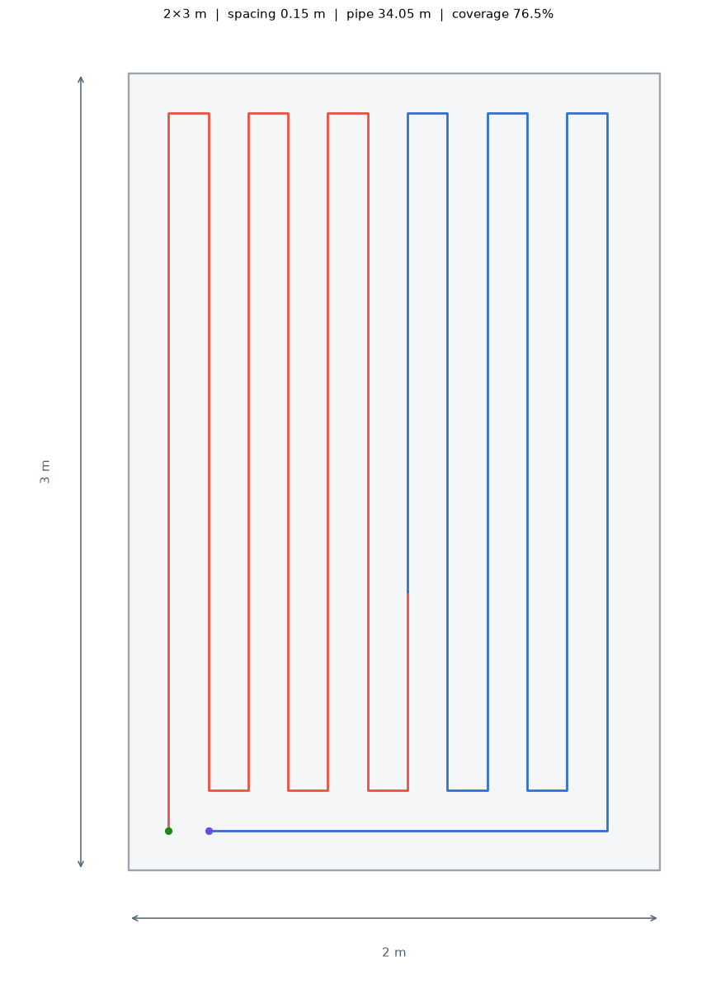
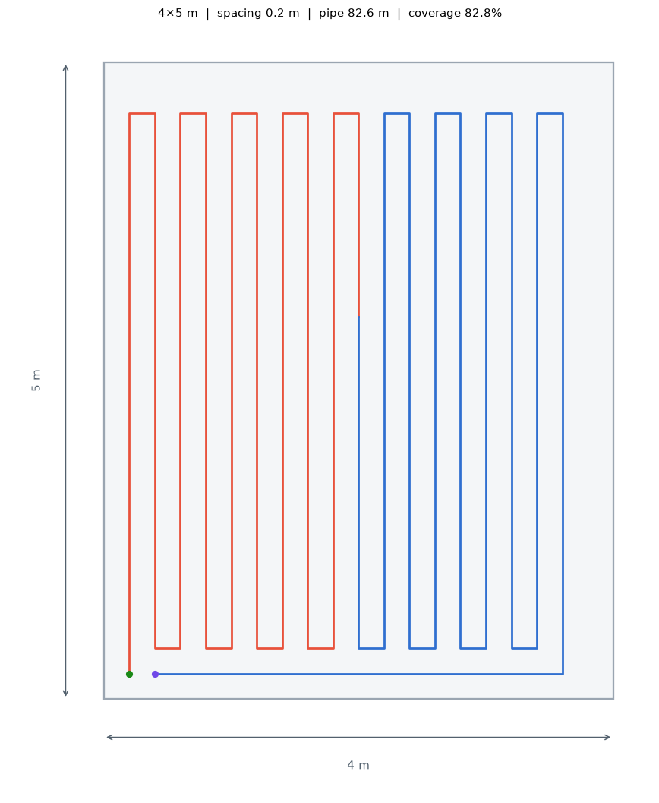
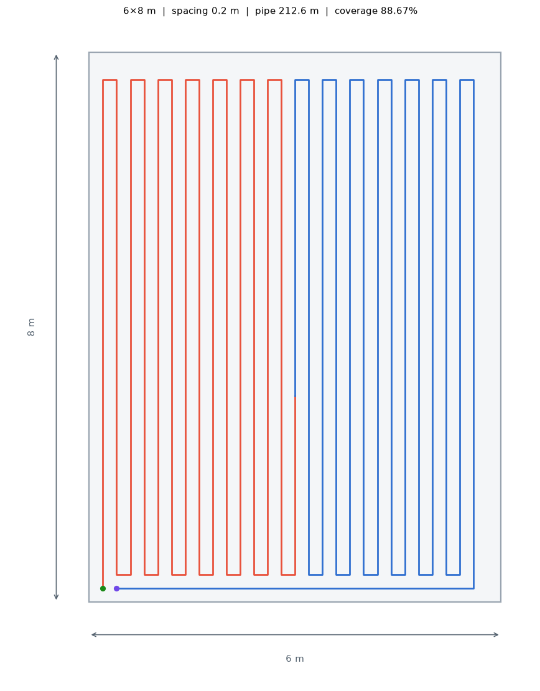
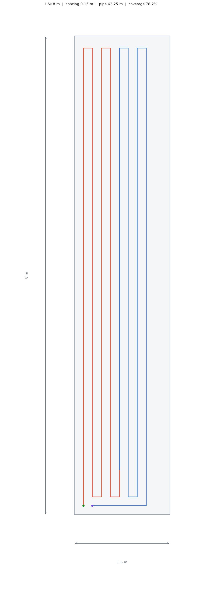
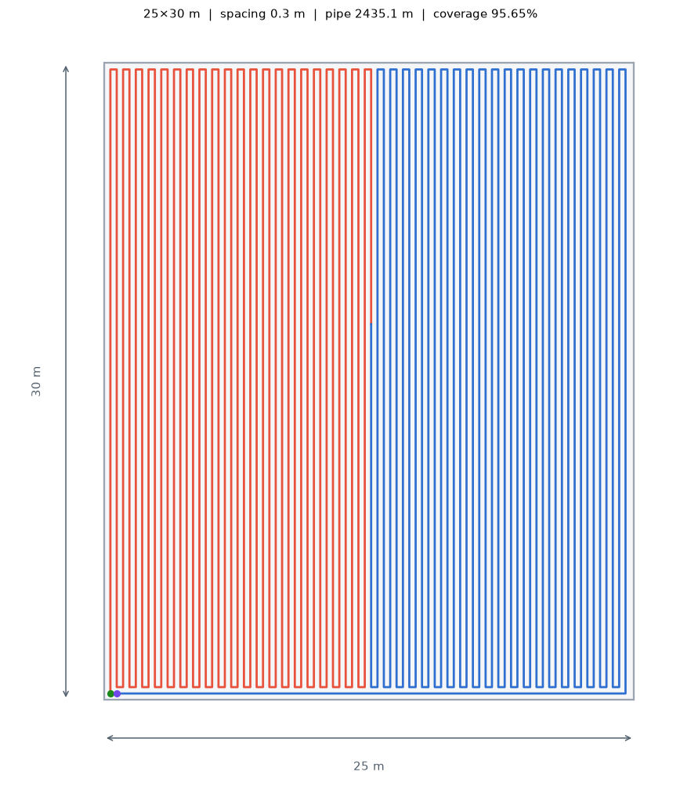
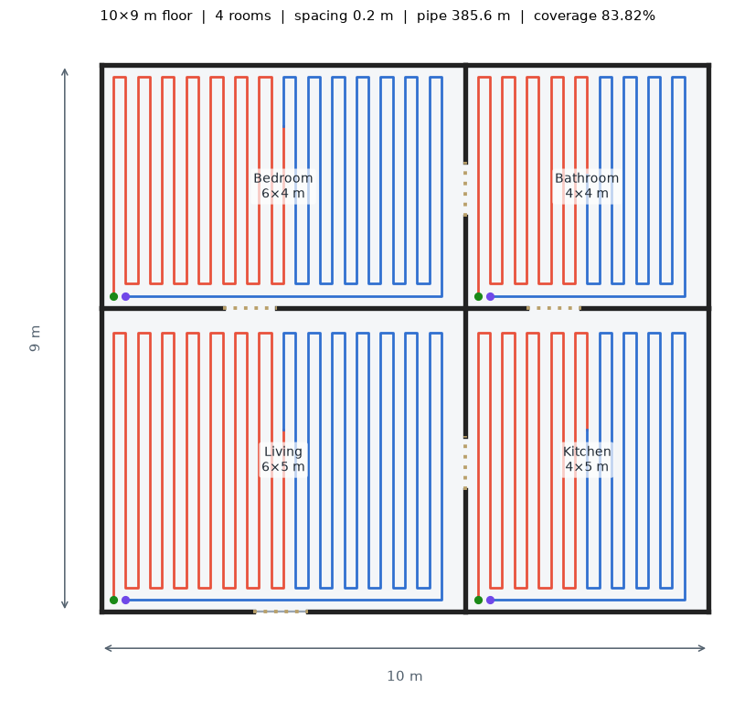

# Example layouts

Generated by [`generate_gallery.py`](generate_gallery.py):

```bash
python examples/generate_gallery.py
```

| Layout | Dimensions | Spacing | Area | Pipe length | Coverage |
| ------ | ---------- | ------- | ---- | ----------- | -------- |
| Bathroom | 2 × 3 m | 150 mm | 6 m² | 34.05 m | 76.5 % |
| Bedroom | 4 × 5 m | 200 mm | 20 m² | 82.6 m | 82.8 % |
| Living room | 6 × 8 m | 200 mm | 48 m² | 212.6 m | 88.67 % |
| Hallway | 1.6 × 8 m | 150 mm | 12.8 m² | 62.25 m | 78.2 % |
| Warehouse bay | 25 × 30 m | 300 mm | 750 m² | 2435.1 m | 95.65 % |
| Apartment floor plan | 10 × 9 m (4 rooms) | 200 mm | 90 m² | 385.6 m | 83.82 % |

## Previews

### Bathroom

Small wet room, tight 150 mm spacing for fast warm-up.



### Bedroom

Typical bedroom at standard 200 mm spacing.



### Living room

Open living space, 200 mm spacing.



### Hallway

Long, narrow corridor.



### Warehouse bay

Industrial slab (750 m²).



### Apartment floor plan

Four rooms with doorway openings; each room has its own loop.


