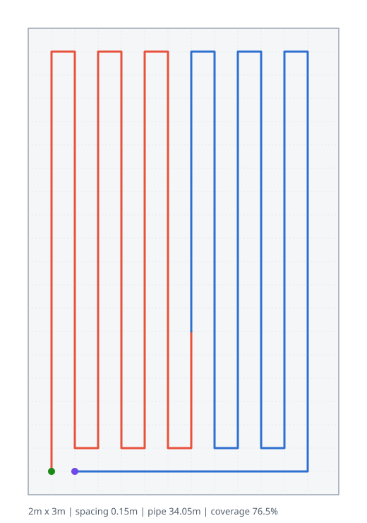
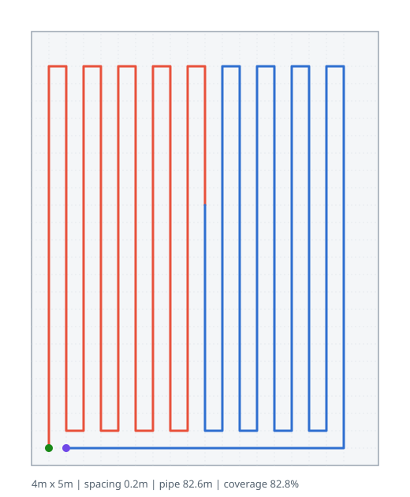
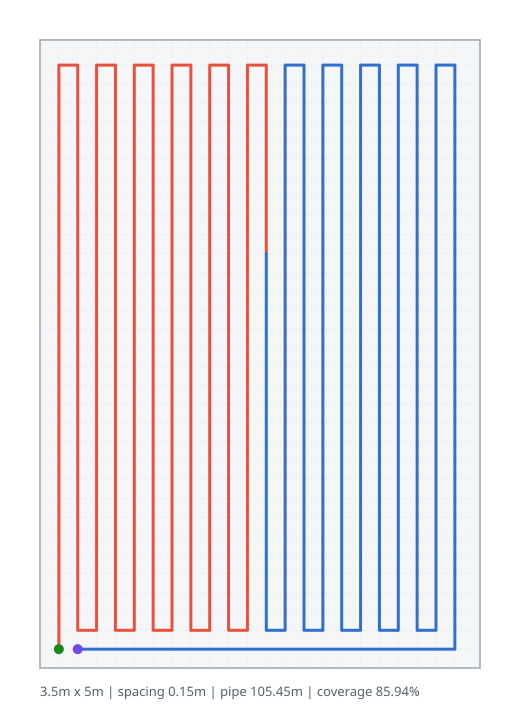
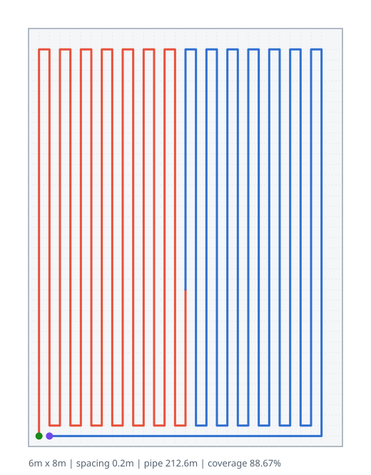
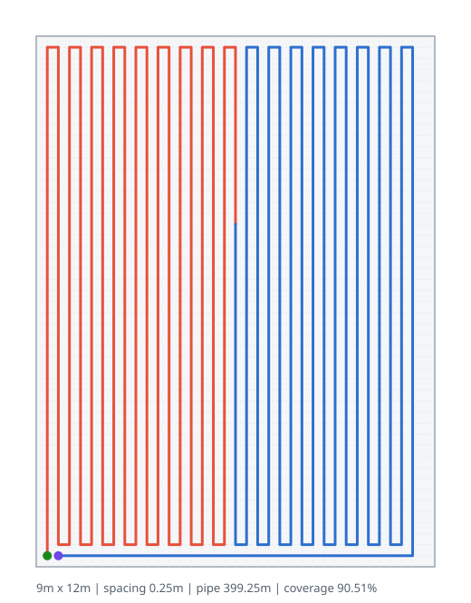
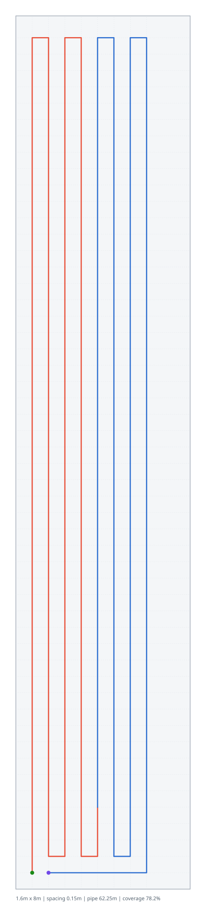
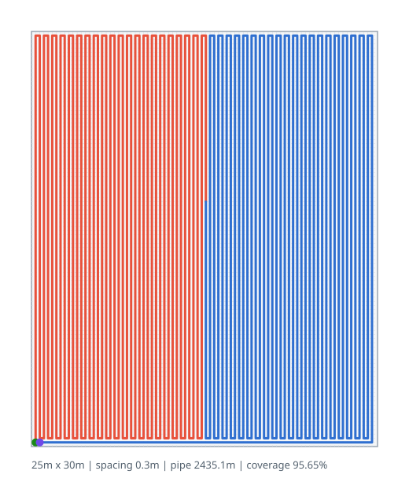

# Example layouts

Generated by [`generate_gallery.py`](generate_gallery.py):

```bash
python examples/generate_gallery.py
```

| Room | Dimensions | Spacing | Area | Pipe length | Coverage | Density |
| ---- | ---------- | ------- | ---- | ----------- | -------- | ------- |
| Bathroom | 2 × 3 m | 150 mm | 6 m² | 34.05 m | 76.5 % | 5.675 m/m² |
| Bedroom | 4 × 5 m | 200 mm | 20 m² | 82.6 m | 82.8 % | 4.13 m/m² |
| Kitchen | 3.5 × 5 m | 150 mm | 17.5 m² | 105.45 m | 85.94 % | 6.0257 m/m² |
| Living room | 6 × 8 m | 200 mm | 48 m² | 212.6 m | 88.67 % | 4.4292 m/m² |
| Open-plan floor | 9 × 12 m | 250 mm | 108 m² | 399.25 m | 90.51 % | 3.6968 m/m² |
| Hallway | 1.6 × 8 m | 150 mm | 12.8 m² | 62.25 m | 78.2 % | 4.8633 m/m² |
| Warehouse bay | 25 × 30 m | 300 mm | 750 m² | 2435.1 m | 95.65 % | 3.2468 m/m² |

## Previews

### Bathroom

Small wet room, tight 150 mm spacing for fast warm-up.



### Bedroom

Typical bedroom at standard 200 mm spacing.



### Kitchen

Higher output for a hard-floor kitchen.



### Living room

Open living space, 200 mm spacing.



### Open-plan floor

Large open plan, 250 mm spacing.



### Hallway

Long, narrow corridor.



### Warehouse bay

Industrial slab (750 m²), static layout.


